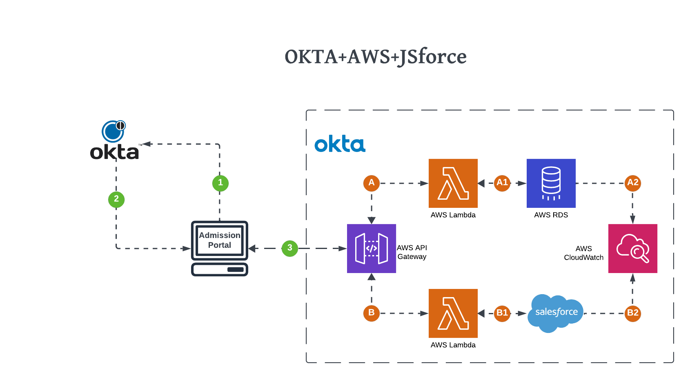
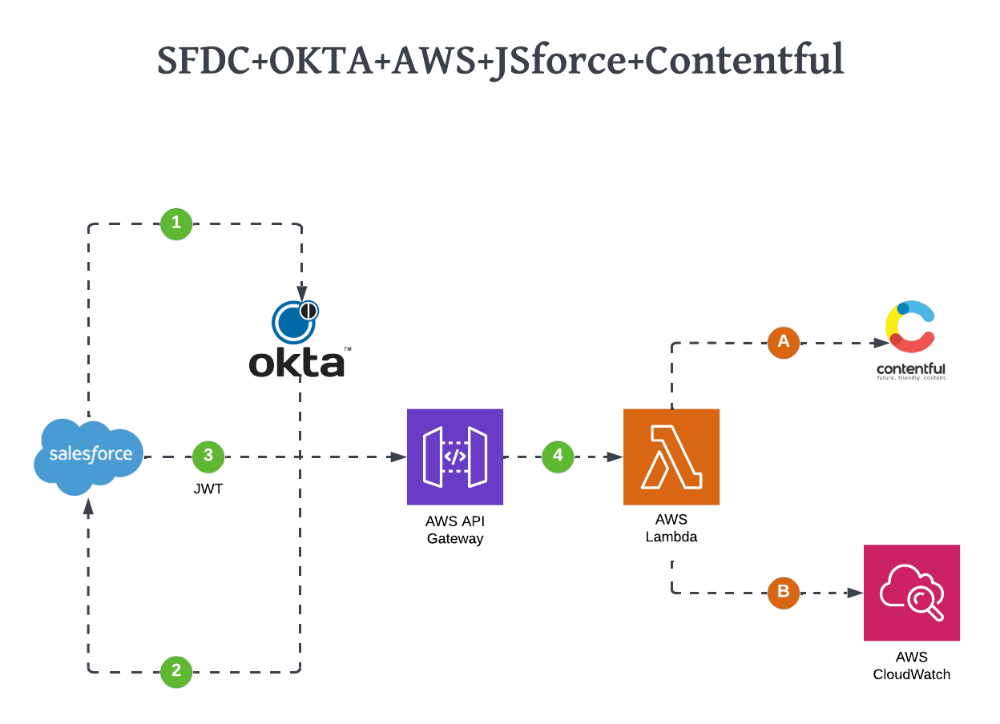

<!-- PROJECT LOGO -->
<br />
<div align="center">
  <a href="https://github.com/othneildrew/Best-README-Template">
    
  </a>

<h3 align="center">APC AWS Lambda Project</h3>

  <p align="center">
    This project supports the APC application, specifically this project contains APIs that can access Salesforce using JSforce library, as well as access RDS PostgreSQL Database.
    <br />

</p>
</div>

<!-- ABOUT THE PROJECT -->
<h1 align="center">About The Project</h1>

<h3 align="left">Lambda Diagram for connecting with SFDC and PostgreSQL</h3>
<div align="center">
  <a href="https://github.com/othneildrew/Best-README-Template">
    
  </a>
</div>

<h3 align="left">Lambda Diagram for connecting with Contentful for the AD-Hoc Sync job</h3>
<div align="center">
  <a href="https://github.com/othneildrew/Best-README-Template">
    
  </a>
</div>

This project performs various C.R.U.D Operations on the APC - Product Catalogue objects in salesforce. It will
also have APIs that access an RDS database to perform various read operations such as product listing etc.
Lastly, this project includes a Lambda function that will be triggered from SFDC when new products are added and needed
to be synced up with Contentful

Project Features:

* Ability to Authenticate using OKTA Authentication mechanisms
* Ability to access REST APIs in a secure manner using JWT Authorizers
* Ability to perform various C.R.U.D Operations on salesforce, RDS PostgreSQL, and Contentful

<p align="right">(<a href="#top">back to top</a>)</p>

### Built With

This section should list any major frameworks/libraries used to bootstrap your project. Leave any add-ons/plugins for
the acknowledgements section. Here are a few examples.

* [Lambda](https://aws.amazon.com/lambda/)
* [API Gateway](https://docs.aws.amazon.com/apigateway/index.html)
* [AWS RDS](https://docs.aws.amazon.com/rds/index.html)
* [CloudFormation](https://aws.amazon.com/cloudformation/)
* [CloudWatch](https://aws.amazon.com/cloudwatch/)
* [JWT](https://jwt.io/)
* [OKTA](https://www.okta.com/)
* [NodeJS](https://nodejs.org/en/)
* [JsForce](https://jsforce.github.io/document/)
* [SalesForce](https://trailhead.salesforce.com/trails/)
* [Contentful](https://www.contentful.com/developers/docs/)

<p align="right">(<a href="#top">back to top</a>)</p>

<!-- GETTING STARTED -->

## Getting Started

To set up your project locally. follow the below steps:

### Prerequisites

Below is a list of Prerequisites to be installed

1. Install [NodeJs](https://nodejs.org/en/)
2. Install or use an existing IDE ([VsCode](https://code.visualstudio.com/)
   or [webstorm](https://www.jetbrains.com/webstorm/))
3. Run The following command after Nodejs is installed

    ```sh
      npm install npm@latest -g
      ```

### Installation

To Install the App Locally follow the below steps:

1. Clone the repo
   ```sh
   git clone git@bitbucket.org:aqd/product-catalogue-jsforce.git
   ```
2. Open your new project with your favorite IDE
3. Open up a command prompt
4. Install NPM packages
   ```sh
   npm install
   ```

<p align="right">(<a href="#top">back to top</a>)</p>


<!-- Project Structure -->

## Project Folder Structure

* etc
    * used for the sonar qube executable files

* images
    * used for any images needed for this project

* Lambdas
    * This is where the lambda functions will live for the various REST API
        * [CompositeCalls](Lambdas%2FCompositeCalls): This is where you will find any lambdas that make Lambda to Lambda
          calls
        * [Contentful](Lambdas%2FContentful): This is where you will find lambdas that communicates with the
          CMS [Contentful]
        * [Postgresql](Lambdas%2FPostgresql): This is where you will find lambdas that communicates with the
          database [PostgreSQL]
        * [Salesforce](Lambdas%2FSalesforce): This is where you will find lambdas that communicates with the
          CRM [SalesForce]

* Layers
    * All the node packages will reside in this directory

<p align="right">(<a href="#top">back to top</a>)</p>

<!-- CONTRIBUTING -->

## Contributing

### Enhancing Project structure

If you have a suggestion that would make this better, please fork the repo and create a pull request.

1. Fork the Project
2. Create your Feature Branch (`git checkout -b feature/AmazingFeature`)
3. Commit your Changes (`git commit -m 'Add some AmazingFeature'`)
4. Push to the Branch (`git push origin feature/AmazingFeature`)
5. Open a Pull Request

### Creating new APIs

If you need to create a new API follow the below steps:

1. Fork the Project
2. Create your Feature Branch (`git checkout -b feature/newAPIName`)
3. Duplicate one of the APIs under the **"Lambdas"** directory
4. Make updates to the following
    1. Rename your newly copied API
    2. Make the necessary edits inside the **"index.js"** and **"package.json"** files
    3. Add any necessary node modules inside **"Layers/nodejs/node_modules"** directory
    4. Open the **"template.yaml"**
    5. Add your new function's cloud formation configuration "replacing the APIName"

   ```sh
    ###########################################################
    #    APIName Lambda Function
    ###########################################################
    APIName:
      Type: AWS::Serverless::Function
      Properties:
        #This is the Lambda Function Name that will be displayed in AWS Console  and it will append the StackEnv value
        FunctionName: !Sub APIName-${StackEnv}
        CodeUri: Directory/to/your/code
        Role: !Ref Role
        Events:
          ApiEventGET:
            Type: HttpApi
            Properties:
              ApiId: !Ref MyHttpApi
              Path: '/APIName'
              Method: GET
          ApiEventPOST:
            Type: HttpApi
            Properties:
              ApiId: !Ref MyHttpApi
              Path: '/APIName'
              Method: POST
   ```
5. Commit your Changes (`git commit -m 'Add some newAPIName'`)
6. Push to the Branch (`git push origin feature/newAPIName`)
7. Open a Pull Request

<p align="right">(<a href="#top">back to top</a>)</p>


<!-- CONTACT -->

## Contact

AQD Engineering

<p align="right">(<a href="#top">back to top</a>)</p>

<!-- ACKNOWLEDGMENTS -->

## Acknowledgments

Use this space to list resources you find helpful and would like to give credit to. I've included a few of my favorites
to kick things off!

* [Choose an Open Source License](https://choosealicense.com)
* [GitHub Emoji Cheat Sheet](https://www.webpagefx.com/tools/emoji-cheat-sheet)
* [Malven's Flexbox Cheatsheet](https://flexbox.malven.co/)
* [Malven's Grid Cheatsheet](https://grid.malven.co/)
* [Img Shields](https://shields.io)
* [GitHub Pages](https://pages.github.com)
* [Font Awesome](https://fontawesome.com)
* [React Icons](https://react-icons.github.io/react-icons/search)

<p align="right">(<a href="#top">back to top</a>)</p>
